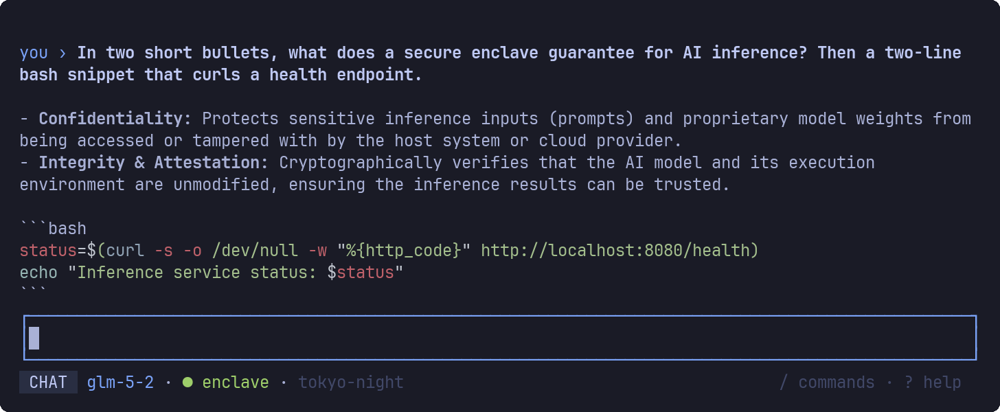
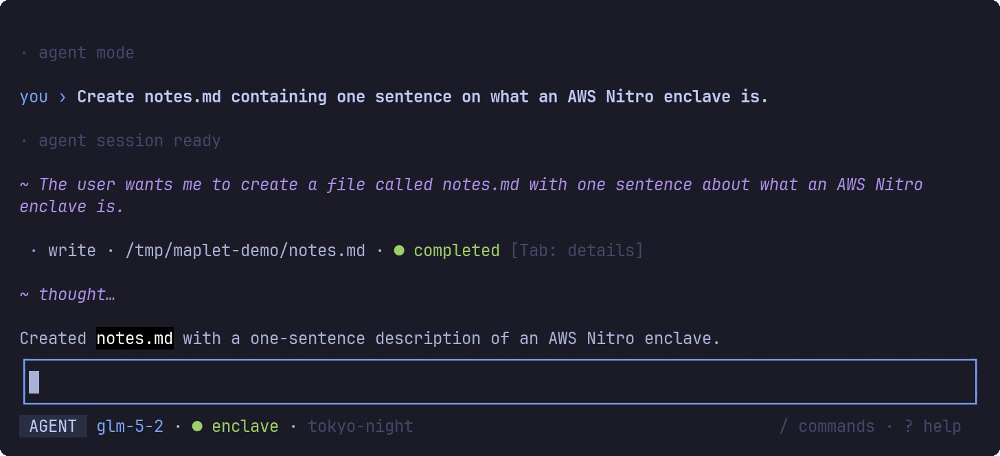
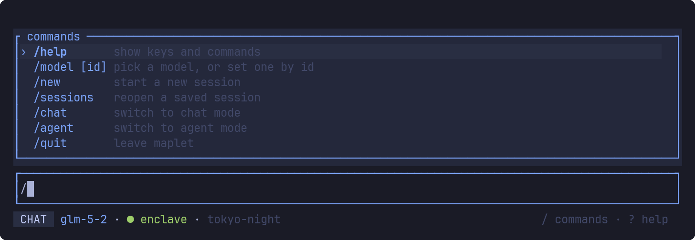

# maplet

An omarchy-native terminal client for [Maple AI](https://trymaple.ai) — private,
end-to-end-encrypted AI chat and **agent mode**, in your terminal, themed by your
active omarchy theme.



Chat streams markdown with syntax-highlighted code, and takes its colours from
whichever omarchy theme is active (Tokyo Night above).



Agent mode runs [goose](https://github.com/aaif-goose/goose) against the same
encrypted enclave, showing its thinking, collapsible tool calls, and permission
prompts inline.

```
maplet (one binary)
 ├─ embedded maple-proxy ── attestation + E2EE ──▶ enclave.trymaple.ai (AWS Nitro TEE)
 ├─ chat mode ── OpenAI-compat SSE ──▶ embedded proxy
 └─ agent mode ── ACP ──▶ goose subprocess ── OpenAI-compat ──▶ embedded proxy
```

All inference stays end-to-end encrypted to Maple's enclave; the embedded
[maple-proxy](https://github.com/opensecretcloud/maple-proxy) handles attestation and
crypto in-process (loopback only, ephemeral port). Agent mode drives
[goose](https://github.com/aaif-goose/goose) — the same engine behind Maple's Agent
Mode — over the [Agent Client Protocol](https://agentclientprotocol.com), so the agent's
model calls are enclave-encrypted too.

## Setup

1. **Build**: `cargo build --release` (binary: `target/release/maplet`)
2. **API key** (Maple Pro/Team/Max, created at trymaple.ai):
   ```sh
   mkdir -p ~/.config/maple-tui
   (umask 077; $EDITOR ~/.config/maple-tui/api_key)   # paste key, save
   ```
   or `export MAPLE_API_KEY=...` (env wins over the file).
3. **goose** (agent mode only):
   ```sh
   curl -fsSL https://github.com/aaif-goose/goose/releases/download/stable/download_cli.sh | CONFIGURE=false bash
   ```

## Usage

`maplet` — the TUI. Also: `maplet repl` (plain chat REPL), `maplet models`,
`maplet agent-oneshot "<prompt>"` (headless agent turn, prints ACP events).

### Commands

Type `/` for a filtered completion list; `Tab` completes, `Enter` runs the
highlighted command, `Esc` dismisses.



| Command | Action |
|---|---|
| `/help` | show keys and commands |
| `/model [id]` | pick a model, or set one by id |
| `/new` (`/clear`) | start a new session |
| `/sessions` (`/resume`) | reopen a saved session |
| `/chat` · `/agent` | switch mode |
| `/quit` (`/exit`, `/q`) | leave maplet |

### Keys

| Key | Action |
|---|---|
| `Enter` / `Alt+Enter` | send / newline |
| `Esc` | cancel turn · close modal |
| `Ctrl+T` | toggle chat ↔ agent mode |
| `Ctrl+O` / `Ctrl+P` / `Ctrl+N` | model picker / session picker / new session |
| `Tab` | focus tool cards; again to expand raw input/output |
| `y a n N` | permission prompt: allow once / always / reject once / always |
| `PgUp/PgDn` · `End` | scroll · follow live output |
| `?` | help |

## Config (`~/.config/maple-tui/config.toml`, all optional)

```toml
[chat]
model = "glm-5-2"

[agent]
model = "glm-5-2"        # needs tool calling; glm-5-2 is Maple's own agent default
cwd = "~"                # agent session working directory
builtins = ["developer"] # goose builtin extensions (shell + file tools)

[[agent.mcp_servers]]    # injected into the agent session via ACP
name = "time"
transport = "stdio"      # or "http" (streamable HTTP; SSE unsupported)
command = "uvx"
args = ["mcp-server-time"]

[proxy]
port = 0                 # 0 = ephemeral; avoids Maple Desktop's 8080
pcr0_environment = "production"
```

Goose's own `~/.config/goose/config.yaml` extensions also load (goose wins on
name collisions).

## Notes

- Theming reads `~/.local/state/omarchy/current/theme/colors.toml` live (switch
  themes and maplet restyles); falls back to ANSI-16 off-omarchy.
- Chat sessions persist locally under `~/.local/share/maple-tui/sessions/`.
  Agent sessions are persisted by goose itself (resume is on the roadmap).
- Logs: `~/.local/state/maple-tui/maplet.log.*` (`RUST_LOG=debug` for goose ACP
  traffic).
- The Maple API key is sent only to the embedded loopback proxy, which talks
  only to the attested enclave.

MIT, like Maple itself.
